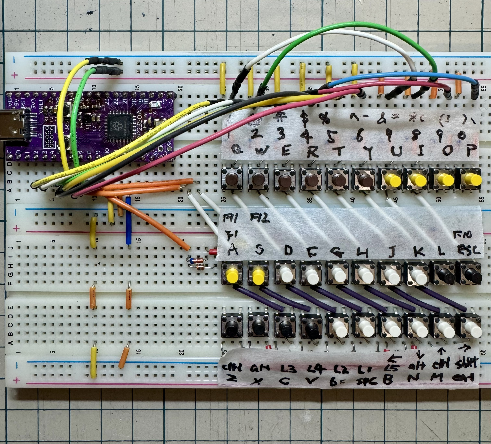
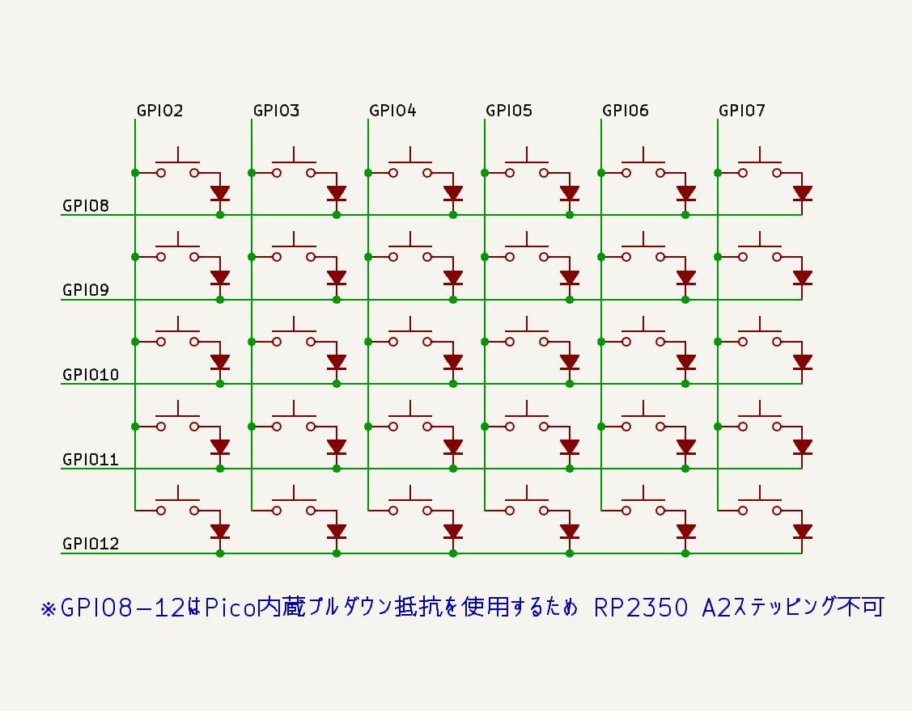
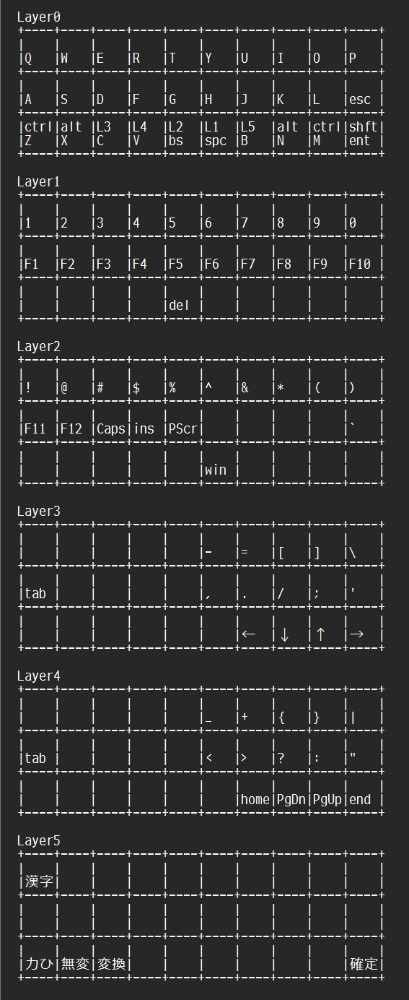

# PiPi-Gherkin-Breadboardha

**人類には早すぎる30%キーボード「PiPiGherkin」をブレッドボードで爆速再現したやつ（ha）**  
RP2040 / RP2350 + CircuitPython 10 + KMK で完全動作、日本語対応済み  
ハンダ不要・ブレッドボード1枚で30キー全部動く伝説のキーボード



## 特徴
- 30キー（3×10）PiPiGherkinレイアウト完全再現  
- ハンダ不要！ミニブレッドボードで完結  
- タクトスイッチ使用  
- 6レイヤー（英数・記号・ファンクション・システム・日本語）  
- 日本語入力対応  
- RP2350 A4ステッピングでも動作確認済み  

## 必要なもの
| 部品                     | 個数 | 備考                              |
|--------------------------|------|-----------------------------------|
| AE-RP2040                | 1    | その他 RP2040マイコンボード         |
| タクトスイッチ   　　　　　| 30   | 好きな色で　　                      |
| 1N4148 ダイオード        | 30  | 50本150円とかで買える            |
| ブレッドボード 　　      | 2    | どこの誤家庭にもあるヤツ           |
| ジャンパー線（Dupont）   | 適量 | めっちゃ使う                      |

## 回路図


## 使い方（5分で動く）
1. RP2040に CircuitPython 10.0.3 を書き込む  
   → https://downloads.circuitpython.org/bin/raspberry_pi_pico/ja/adafruit-circuitpython-raspberry_pi_pico-ja-10.0.3.uf2
2. `lib` フォルダに KMK最新（Commit 5a6669d）のkmkフォルダをコピーする  
   → https://github.com/KMKfw/kmk_firmware/archive/5a6669d1da219444e027fb20f57d4f5b3ecdedfe.zip
3. `code.py`  をルートにコピー
4. ブレッドボードにスイッチとダイオードを刺す
5. USB挿す → 即キーボード認識！

## ファイル構成
```
PiPi-Gherkin-Breadboardha/
 ├── code.py          ← メイン（400行くらい）
 └── README.md        ← 今読んでるやつ
```
## キーマップ


## ライセンス
GNU General Public License v3.0 (GPLv3)  

## Credits & 感謝
- **全体の普及 & インスピレーション**: jefmer さんの 40% Keyboards ブログ（PiPi Gherkinの設計・ビルドガイド）  
  → https://www.40percent.club/2021/02/pipi-gherkin.html  
- **PiPiGherkin レイアウト & PRK keymap**: picoruby/prk_pipigherkin (MIT License) – PicoRubyチーム（特に HASUMI Hitoshi さん @h2srt に感謝！）  
  → https://github.com/picoruby/prk_pipigherkin  
- **KMK Firmware**: https://github.com/KMKfw/kmk_firmware (GPLv3)  
- **CircuitPython**: Adafruit (MIT License)  
- **最初に火をつけた**: CQ出版 Interface 2021年8月号 サポートページ  
  → https://interface.cqpub.co.jp/2021keybo01/  
- そしてこの「ha」を生み出した運命（笑）

質問・「俺も作った！」報告はXのリプかIssuesで待ってます！  
→ https://x.com/DragonBallEZ

**人類には早すぎるキーボード、いっしょに作ろうぜ！（ha）**
